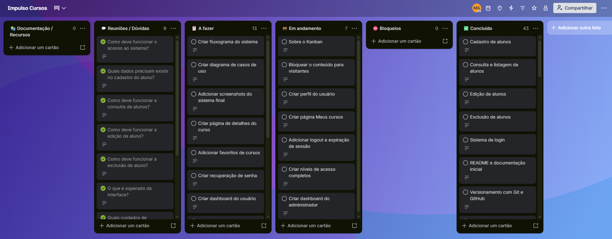
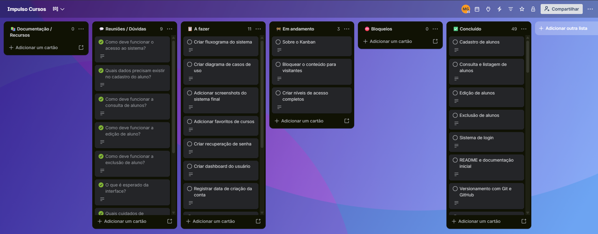
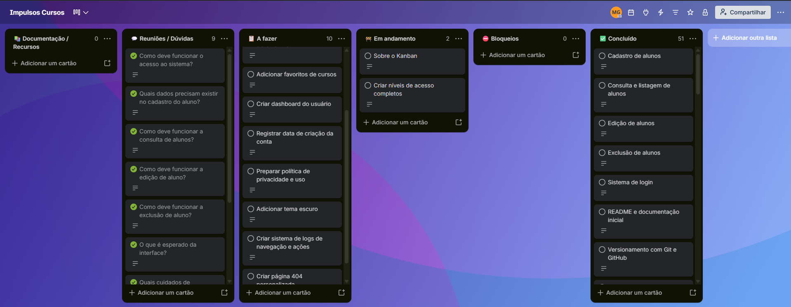

# Impulso Cursos

Sistema web fictício de gestão de alunos, desenvolvido com PHP, PDO e PostgreSQL.

## Funcionalidades

- Cadastro público de conta e aluno em Cadastre-se; consulta, edição e exclusão administrativas
- Pesquisa de aluno por ID ou CPF
- Relatório com filtros por turma e situação
- Validação matemática dos dígitos verificadores do CPF
- Cadastro e autenticação de usuários com senha protegida por hash
- Menus e páginas controlados pelo papel da conta
- Gestão administrativa de cursos e consulta de usuários e vínculos
- Catálogo, detalhes, inscrição e consulta de Meus cursos
- Dashboard próprio para usuários autenticados, com resumo da conta, aluno vinculado, totais e prévias de até três cursos, além de atalhos
- Recuperação de senha demonstrativa local para contas comuns de teste
- Política de Privacidade pública em `privacidade.php`, acessível pelo rodapé de todas as páginas

## Documentação do projeto

- [Documentação técnica e roteiro de testes](documentacao.md)
- [Dicionário de dados](dicionario.md)
- [Diagramas de entidades e fluxos](diagrama.md)
- [Briefing do cliente](briefing.md)

A recuperação de senha funciona somente em conexões locais (`127.0.0.1` ou `::1`). Não envia e-mail nem verifica identidade: use apenas contas de teste. O fluxo e suas limitações estão descritos na [documentação](documentacao.md#recuperação-de-senha-demonstração-local).

## Perfis de acesso

| Perfil | Acesso |
| --- | --- |
| Visitante | Login e cadastro de conta com dados do aluno |
| Usuário | Início, perfil, cursos e sair |
| Administrador | Gestão de alunos, relatório, cursos, perfil e sair |

O cadastro público sempre cria contas do tipo `usuario`. A conta admin é promovida diretamente no banco e uma constraint limita esse papel ao e-mail autorizado. Após mudar o papel no banco, saia e entre novamente para atualizar a sessão. O perfil exibe os dados do aluno vinculado à conta ou informa que ainda não existe vínculo.

## Dashboard do usuário

O login de uma conta `usuario` abre `app/dashboard.php`; o link Início e o acesso ao index autenticado também levam ao dashboard. Administradores entram em `app/admin.php` e são redirecionados para esse painel se tentarem abrir o dashboard do usuário. Visitantes continuam vendo o index público.

O dashboard usa apenas o ID da sessão, exibe `usuarios.created_at` e aceita contas sem aluno vinculado ou sem inscrições. Para conferir, entre com uma conta comum com e sem inscrições/vínculo, confira totais e data, teste os atalhos e tente adicionar `?usuario_id=outro_id` (os dados devem continuar sendo os seus). Sem login, o dashboard deve levar ao login; com admin, ao painel. Confira também o catálogo vazio e o layout em desktop, tablet e celular.

## Requisitos

- PHP com `pdo_pgsql` habilitado
- PostgreSQL
- `psql` para executar os scripts SQL pelo terminal

## Tecnologias

- PHP e PDO
- PostgreSQL
- HTML e CSS
- Git e GitHub

## Protótipos

Para abrir e visualizar os protótipos `.excalidraw` no VS Code, instale a extensão Excalidraw.

### Telas

<!-- markdownlint-disable MD033 -->
<details>
<summary>Tela inicial</summary>


</details>
<details>
<summary>Tela de login</summary>


</details>
<details>
<summary>Tela de cadastro</summary>


</details>
<details>
<summary>Tela de cadastro de aluno</summary>


</details>
<details>
<summary>Tela de exclusão</summary>


</details>
<details>
<summary>Tela de confirmação de exclusão</summary>


</details>
<details>
<summary>Tela de resultado da consulta</summary>


</details>

## Evolução do projeto no Trello

O desenvolvimento do **Impulso Cursos** foi acompanhado por um quadro Kanban no Trello.

As imagens abaixo registram a evolução das tarefas conforme os commits do projeto avançaram.

<details>
<summary><strong>Primeiros 7 commits</strong></summary>

Nesta etapa foi organizada a base inicial do projeto, incluindo estrutura, CRUD de alunos, login, documentação e versionamento.


</details>

<details>
<summary><strong>Commits 8–15</strong></summary>

Continuação da documentação e criação dos diagramas do sistema e do banco de dados.


</details>

<details>
<summary><strong>Commits 16–21</strong></summary>

Evolução da documentação, dicionário de dados e segurança das senhas com hash.


</details>

<details>
<summary><strong>Commits 22–28</strong></summary>

Melhorias no cadastro de usuários, autenticação, mensagens e tratamento de erros.


</details>

<details>
<summary><strong>Commits 29–35</strong></summary>

Testes de autenticação e cadastro, além da criação dos protótipos das telas no Excalidraw.


</details>

<details>
<summary><strong>Commits 36–42</strong></summary>

Inclusão das imagens dos protótipos no README e documentação adicional das páginas do sistema.


</details>

<details>
<summary><strong>Commits 43–49</strong></summary>

Criação do briefing do cliente, melhorias de segurança na exibição de dados e revisão da conexão e do schema PostgreSQL.


</details>

<details>
<summary><strong>Commits 50–56</strong></summary>

Implementação de CPF no cadastro, edição, relatório e busca, além de melhorias nos filtros e no CSS.


</details>

<details>
<summary><strong>Commits 57–63</strong></summary>

Refatoração e organização do código, revisão dos arquivos de sessão/login e melhoria da estrutura dos scripts do banco de dados.


</details>

<details>
<summary><strong>Commits 64–70</strong></summary>

<br>

Implementação da validação matemática de CPF, criação do verificador de CPF, ajustes no cadastro de alunos e melhoria da documentação. Também foram adicionadas imagens do Trello ao README, instruções de uso mais completas e uma organização melhor para visualizar os protótipos.


</details>

<details>
<summary><strong>Commits 71–77</strong></summary>

Atualização do quadro Trello com o acompanhamento das tarefas de perfil do usuário, cursos e níveis de acesso.



</details>
<details>
<summary><strong>Commits 78–84</strong></summary>

Atualização do quadro Trello com o acompanhamento das tarefas concluídas, em andamento e planejadas, incluindo recuperação de senha, dashboard do usuário e níveis de acesso.



</details>

<details>
<summary><strong>Commits 85–91</strong></summary>

Atualização do quadro Trello com 51 tarefas concluídas, duas em andamento e dez a fazer. Os níveis de acesso completos continuam em andamento, enquanto favoritos de cursos, dashboard do usuário, tema escuro e logs de navegação e ações permanecem planejados.



</details>
<!-- markdownlint-enable MD033 -->

## Estrutura principal

A estrutura abaixo apresenta os arquivos atuais do projeto, incluindo a recuperação de senha, a gestão de cursos, os protótipos e as imagens do Trello até os commits 85–91.

```text
impulsos_cursos/
├── app/
│   ├── admin.php                 # área administrativa
│   ├── alunos_cursos.php         # consulta dos cursos dos alunos
│   ├── create.php                # redirecionamento para cadastro/vínculo
│   ├── curso.php                 # detalhes e inscrição em um curso
│   ├── curso_create.php          # cadastro de cursos
│   ├── curso_delete.php          # exclusão de cursos
│   ├── curso_update.php          # edição de cursos
│   ├── cursos.php                # catálogo de cursos
│   ├── cursos_admin.php          # gestão administrativa de cursos
│   ├── delete.php                # exclusão de alunos
│   ├── meus_cursos.php           # cursos da conta autenticada
│   ├── select.php                # relatório/listagem de alunos
│   ├── select_w_w.php            # consulta individual
│   ├── tabela.md                 # documentação relacionada às tabelas
│   ├── update.php                # edição de alunos
│   ├── usuarios.php              # consulta de usuários e seus vínculos
│   └── vincular_conta.php        # vínculo entre conta e aluno
│
├── css/
│   └── style.css                 # estilos compartilhados do sistema
│
├── database/
│   ├── auto_destruicao/
│   │   └── reset_database.pgsql  # recriação destrutiva do banco em desenvolvimento
│   ├── adicionar_tipo_usuario.sql # adiciona nível de acesso aos usuários
│   ├── adicionar_created_at_usuarios.sql # adiciona a data de criação das contas
│   ├── ajustar_senha.sql         # ajustes relacionados às senhas
│   ├── connect_postgres.php      # conexão com PostgreSQL
│   ├── table.pgsql               # criação das tabelas
│   ├── verificar_created_at.php  # teste isolado da data de criação das contas
│   ├── vincular_alunos_usuarios.sql # migração do vínculo opcional
│   └── verificar_user.php        # teste de cadastro e autenticação
│
├── includes/
│   ├── curso_admin_form.php      # formulário compartilhado de gestão de cursos
│   ├── data_conta.php            # formatação da data de criação da conta
│   ├── footer.php                # rodapé compartilhado
│   ├── functions.php             # funções reutilizadas pelo sistema
│   ├── header.php                # cabeçalho e menu conforme o tipo de usuário
│   ├── recuperacao_senha.php      # funções de recuperação de senha demonstrativa local
│   └── session.php               # gerenciamento da sessão
│
├── login/
│   ├── cadastrar.php             # cadastro público de usuário
│   ├── login.php                 # autenticação
│   ├── logout.php                # encerramento da sessão
│   ├── perfil.php                # perfil do usuário
│   ├── recuperar_senha.php       # solicitação de recuperação de senha
│   ├── redefinir_senha.php       # definição de uma nova senha
│   ├── verificar_admin.php       # proteção de páginas administrativas
│   ├── verificar_cpf.php         # validação/verificação de CPF
│   └── verificar_user.php        # proteção de páginas autenticadas
│
├── prototipos/
│   ├── imagens/
│   │   ├── tela_cadastrar_aluno.png
│   │   ├── tela_cadastrar.png
│   │   ├── tela_confirmar_exclusao.png
│   │   ├── tela_excluir.png
│   │   ├── tela_inicial.png
│   │   ├── tela_login.png
│   │   └── tela_resultado_da_consulta.png
│   ├── prototipo_impulso_cursos.excalidraw
│   ├── tela_cadastrar_aluno.excalidraw
│   ├── tela_cadastrar.excalidraw
│   ├── tela_confirmar_exclusao.excalidraw
│   ├── tela_consultar.excalidraw
│   ├── tela_excluir.excalidraw
│   ├── tela_inicial.excalidraw
│   ├── tela_login.excalidraw
│   └── tela_resultado_da_consulta.excalidraw
│
├── trello/
│   ├── primeiros7commits.png
│   ├── commits8-15.png
│   ├── commits16-21.png
│   ├── commits22-28.png
│   ├── commits29-35.png
│   ├── commits36-42.png
│   ├── commits43-49.png
│   ├── commits50-56.png
│   ├── commits57-63.png
│   ├── commits64-70.png
│   ├── commits71-77.png
│   ├── commits78-84.png
│   └── commits85-91.png
│
├── briefing.md
├── diagrama.md
├── dicionario.md
├── documentacao.md
├── index.php
└── README.md
```

## Preparar o banco de dados

1. Crie o banco PostgreSQL que será usado pelo sistema.
2. Configure host, nome do banco, usuário e senha em `database/connect_postgres.php`.
3. No terminal aberto na pasta que contém `impulsos_cursos`, crie as tabelas iniciais:

    ```powershell
    psql -h HOST -U USUARIO -d BANCO -f impulsos_cursos/database/table.pgsql
    ```

Substitua `HOST`, `USUARIO` e `BANCO` pelos valores da sua instalação. `table.pgsql` cria tabelas ausentes sem apagar dados e aplica a estrutura de vínculo entre alunos e usuários.

Para atualizar um banco existente e permitir o acesso a **Meu perfil** e o vínculo de contas no painel administrativo, execute:

```powershell
psql -h HOST -U USUARIO -d BANCO -v ON_ERROR_STOP=1 -f impulsos_cursos/database/vincular_alunos_usuarios.sql
```

Essa migração adiciona `alunos.usuario_id`, suas restrições e a proteção de identidade, sem apagar registros ou alterar IDs e sequences. Os alunos antigos ficam sem conta e continuam no relatório. A execução pode ser repetida sem duplicar a relação.

No relatório, abra **Vincular conta a aluno**. Informe o ID do aluno e o e-mail de uma conta real existente, confira os dados e confirme. Cada aluno aceita somente uma conta e cada conta aceita somente um aluno. O vínculo não pode ser alterado enquanto o cadastro existir; ID, CPF e nascimento também são imutáveis.

Em **Cadastre-se**, o próprio aluno informa nome, CPF, nascimento, e-mail e senha. Conta e aluno são gravados na mesma transação, com o aluno ativo, sem turma e ainda sem vínculo. O administrador define a turma na edição do aluno e confirma o vínculo usando o ID do aluno no relatório e o e-mail cadastrado. O painel e o menu administrativos não oferecem mais cadastro de aluno. Se CPF ou e-mail já estiverem cadastrados, o cadastro público é recusado, sem salvar registros parciais.

A exclusão administrativa remove somente o cadastro de aluno e desfaz o vínculo por exclusão. A conta e suas inscrições são preservadas. Quando existem inscrições em cursos, uma segunda tela lista os cursos e exige confirmação adicional. Cancelar mantém o cadastro.

Para atualizar um banco existente com o campo de papel, execute a migração:

```powershell
psql -h HOST -U USUARIO -d BANCO -f impulsos_cursos/database/adicionar_tipo_usuario.sql
```

O papel padrão é `usuario`. Para promover a conta autorizada, conecte-se ao banco e execute:

```sql
UPDATE usuarios
SET tipo = 'admin'
WHERE lower(email) = lower('EMAIL_AUTORIZADO');
```

A constraint `usuarios_admin_email_check` limita `admin` ao e-mail autorizado nos scripts de schema. Se trocar a conta autorizada, atualize essa constraint na migração e nos scripts de criação/reset.

> **Atenção:** `database/auto_destruicao/reset_database.pgsql` apaga e recria `alunos` e `usuarios`, perdendo os registros. Use somente em desenvolvimento e após confirmar o banco e fazer backup.

## Data de criação das contas

Novas instalações incluem `usuarios.created_at TIMESTAMP NOT NULL DEFAULT CURRENT_TIMESTAMP`. Para bancos existentes, execute antes de usar as telas atualizadas:

```powershell
psql -h HOST -U USUARIO -d BANCO -v ON_ERROR_STOP=1 -f impulsos_cursos/database/adicionar_created_at_usuarios.sql
```

A migration não recria tabelas nem altera IDs, senhas ou tipos. Pode ser executada novamente: `IF NOT EXISTS` preserva a coluna já criada. Contas antigas recebem o horário da primeira execução, pois sua data real de criação não foi registrada.

Nos novos cadastros, o INSERT omite `created_at` e o PostgreSQL usa automaticamente `CURRENT_TIMESTAMP` (início da transação). A informação aparece em **Meu perfil** e **Usuários cadastrados**, somente para leitura; campos enviados por GET ou POST não são usados. Login, logout e redefinição de senha não alteram esse valor.

O projeto não configura explicitamente o fuso da conexão nem o do PHP. No teste deste ambiente, PostgreSQL 18.6 informou `America/Sao_Paulo` e PHP informou `UTC`. `TIMESTAMP` não guarda fuso: o valor usa o horário da sessão PostgreSQL e é exibido sem conversão. Confira `SHOW timezone;` no banco e `date_default_timezone_get()` no PHP antes de comparar horários em outra instalação; configurações diferentes podem produzir horários locais diferentes. Esta tarefa não muda configurações globais. Datas ausentes ou inválidas aparecem como **Não informada**.

Teste automatizado com tabelas temporárias, sem modificar contas reais:

```powershell
php impulsos_cursos/database/verificar_created_at.php
```

Para validar as telas, aplique a migration, cadastre uma conta pelo **Cadastre-se** e confira a data no perfil e na listagem administrativa. Anote `created_at`, faça logout/login e redefina a senha pela demonstração local; o valor deve permanecer igual. Envie também um campo extra `created_at` no POST de cadastro: o horário deve continuar sendo preenchido pelo banco. Reexecute a migration e confirme que os valores existentes foram preservados.

## Executar o sistema

1. Confirme que PHP está com `pdo_pgsql` habilitado e que `connect_postgres.php` está configurado.
2. No terminal aberto na pasta que contém `impulsos_cursos`, inicie o servidor:

    ```powershell
    php -S 127.0.0.1:8000
    ```

3. Acesse `http://127.0.0.1:8000/impulsos_cursos/`.
4. Cadastre um usuário em `http://127.0.0.1:8000/impulsos_cursos/login/cadastrar.php`. O cadastro público sempre cria uma conta comum.

## Acesso e segurança

- Visitantes veem somente Login e Cadastre-se no menu.
- Usuários comuns podem abrir perfil e cursos; tentativas de abrir páginas administrativas diretamente recebem HTTP 403.
- Administradores acessam as rotas de gestão protegidas por `login/verificar_admin.php`.
- O login verifica a senha com `password_verify()` e regenera o ID da sessão após autenticar.
- O CPF é validado matematicamente no cadastro e na edição. Isso confere os dígitos verificadores, mas não consulta a Receita Federal nem confirma titularidade.
- Cursos permitem inscrição pela conta logada e o perfil consulta o aluno pelo ID da sessão.

## Testes

Com o terminal na pasta que contém `impulsos_cursos`, rode o teste de cadastro/autenticação:

```powershell
php impulsos_cursos/database/verificar_user.php
```

O teste usa uma tabela temporária e faz rollback ao terminar. Para testar manualmente, confira o menu deslogado, crie uma conta comum, tente abrir `/impulsos_cursos/app/select.php` com ela e depois autentique com a conta admin autorizada.

Após aplicar a migration de vínculo, confira também:

1. Alunos antigos continuam no relatório com **Sem conta** e com os mesmos IDs, CPFs e nascimentos.
2. O perfil de uma conta sem aluno informa ausência de vínculo.
3. Como admin, confira e confirme um vínculo pelo relatório. O status passa a **Conta vinculada** e o perfil mostra o aluno correto.
4. Uma conta não pode ser vinculada a outro aluno e um aluno vinculado não pode receber outra conta.
5. A edição permite nome, turma, e-mail e situação sem alterar ID, CPF, nascimento ou vínculo.
6. Em um cadastro de teste com inscrições, a primeira confirmação de exclusão mostra os cursos. Cancelar mantém o aluno; confirmar novamente remove somente o cadastro e preserva a conta e as inscrições.

Esse roteiro orienta testes manuais; não afirma que eles foram executados no banco real.

## Senhas

As senhas são armazenadas com `password_hash()` e verificadas com `password_verify()`. A senha original não é gravada no banco.

## Publicar alterações no GitHub

Adicione apenas os arquivos que devem entrar no commit:

```powershell
git add caminho/do/arquivo
git commit -m "mensagem do commit"
git push origin main
```

## Autor

### Matheus Gil
