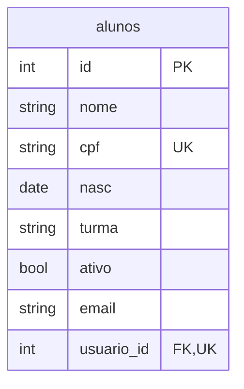

# Tabela alunos banco escola

`usuario_id` é opcional e referencia `usuarios(id)`. O índice único permite vários alunos sem conta e impede uma conta ligada a dois alunos. ID, CPF e nascimento são imutáveis.

Consulte o [dicionário de dados](../dicionario.md) para tipos e restrições e os [diagramas](../diagrama.md) para as relações com cursos e inscrições.
