# Diagramas do sistema

Os arquivos do CRUD utilizam a tabela `alunos`.

O campo `id` é a chave primária. `alunos.usuario_id` é uma FK opcional e única para `usuarios(id)`.

## Diagrama Entidade-Relacionamento

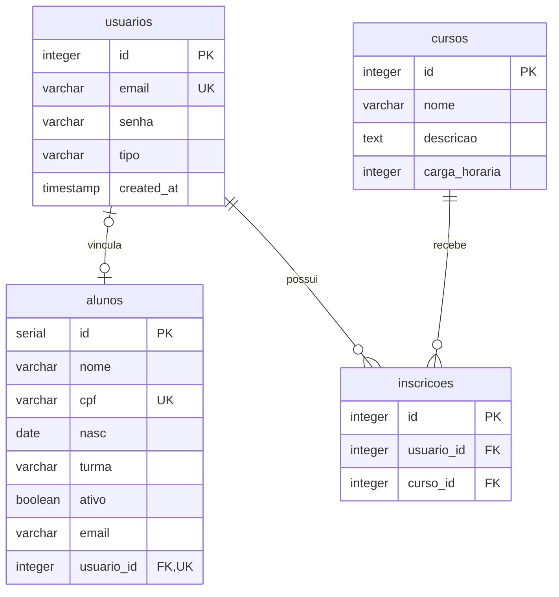

## Documentação do CRUD de alunos

### create.php

É um redirecionamento: encaminha admin para o relatório e as demais contas para Cadastre-se. Não oferece mais um formulário administrativo de cadastro de aluno. O cadastro público cria conta do tipo usuario e aluno na mesma transação, já com usuario_id preenchido automaticamente.

O campo `id` é gerado automaticamente pelo banco de dados.

### select.php

Lista alunos por ID crescente, com filtros opcionais por curso e situação e ação Editar.

### select_w_w.php

Busca e mostra um aluno específico pelo ID ou CPF informado.

### update.php

Busca um aluno pelo `id` e permite alterar:

- nome
- turma
- situação do aluno
- e-mail

ID, CPF, nascimento e vínculo já preenchido são imutáveis. A inscrição pertence à conta e o par `(usuario_id, curso_id)` é único; `alunos.turma` não gera inscrições automaticamente.

### delete.php

Busca um aluno pelo `id`.

Antes da exclusão, mostra o nome e a turma do aluno e pede confirmação para excluir.

## Fluxo de uma requisição

Visitantes que tentam abrir rotas protegidas são encaminhados ao login. Contas comuns que abrem rotas administrativas recebem HTTP 403 com a página personalizada de acesso negado. Após mais de 30 minutos sem atividade, a próxima requisição encerra a sessão e redireciona ao login com aviso de expiração.

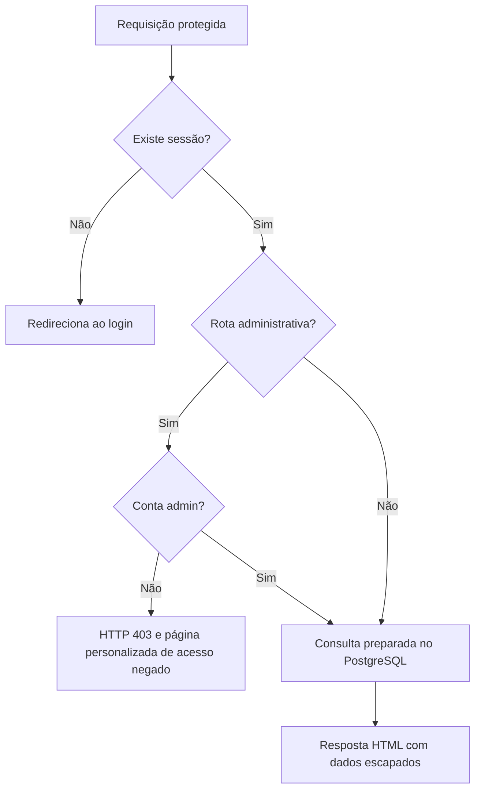

## Vínculo e perfil

O cadastro público obtém o ID da conta com RETURNING id e salva esse ID no aluno dentro da mesma transação. A migration de dados antigos usa correspondências únicas de e-mail normalizado.

O perfil consulta o aluno por `$_SESSION['id']`. Sem vínculo, informa que a conta ainda não está vinculada a um cadastro de aluno. Cursos funcionam também para contas sem aluno.

## Exclusão com confirmação

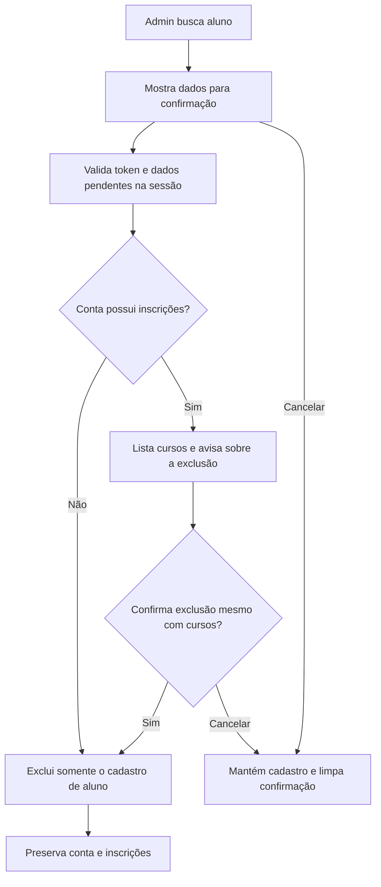

A segunda tela fica em `delete.php`. Excluir o aluno remove seu vínculo e o perfil passa a informar ausência de cadastro.

## Login e logout

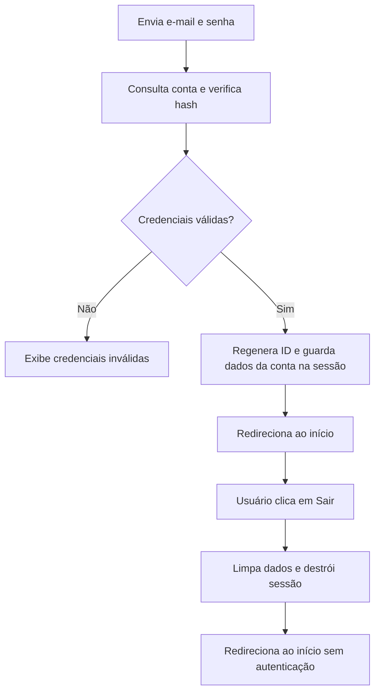

O login usa `password_verify()`. Após o logout, páginas protegidas exigem nova autenticação.

## Inscrição em curso

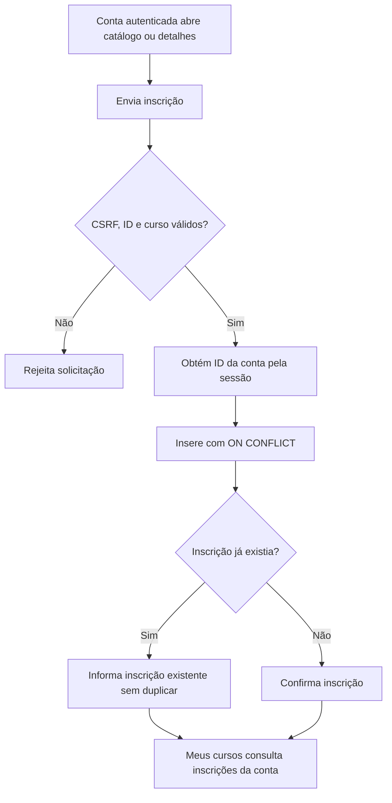

A inscrição não depende de cadastro de aluno. O par `(usuario_id, curso_id)` é único no banco.

## Recuperação de senha demonstrativa local

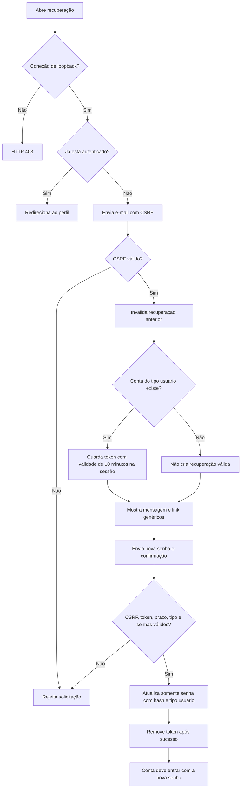

Não há envio de e-mail nem verificação de identidade. Use somente contas de teste no próprio computador. O fluxo não cria tabelas nem realiza login automático.

## Fluxograma geral do sistema

Os diagramas abaixo complementam os fluxos técnicos anteriores e representam as páginas atuais de `login/`, `app/`, os menus de `includes/header.php`, o controle de `includes/session.php` e as funções compartilhadas. O código foi usado para resolver diferenças nas descrições antigas da documentação.

### Visitante, cadastro e entrada

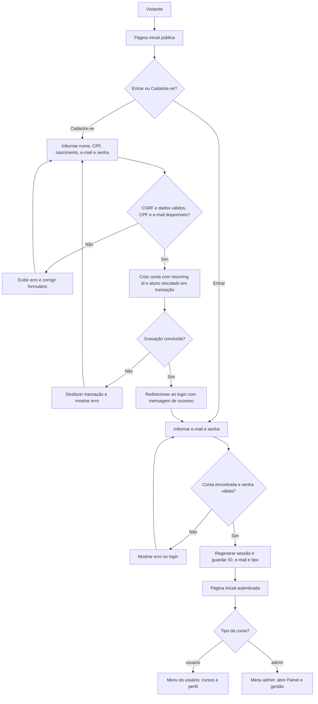

Ambos os tipos de conta são redirecionados ao início após o login; o admin abre o painel pelo menu ou pelos atalhos. O cadastro não autentica automaticamente nem vincula aluno por e-mail. O aluno começa ativo e com turma `Sem turma`.

### Fluxo do usuário

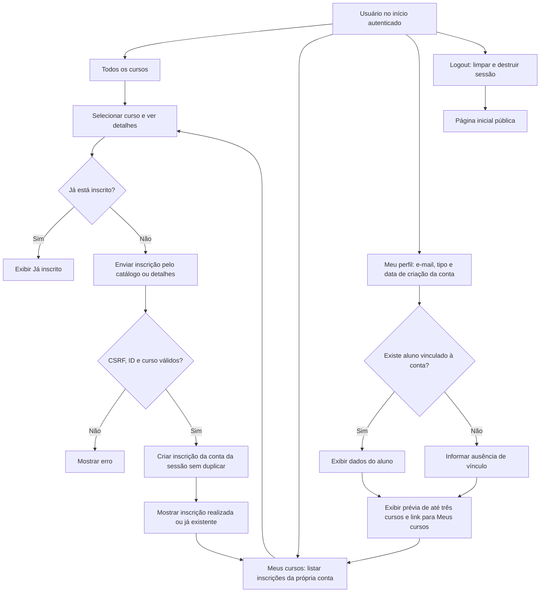

Cursos e inscrições pertencem à conta e funcionam sem aluno vinculado. O perfil consulta o ID da sessão e não permite escolher outra conta; não exibe senha nem CPF. Admin também pode abrir catálogo, detalhes e Meus cursos: essas rotas exigem autenticação, não um papel específico. Seu perfil não mostra a prévia de cursos.

### Cancelamento de inscrição

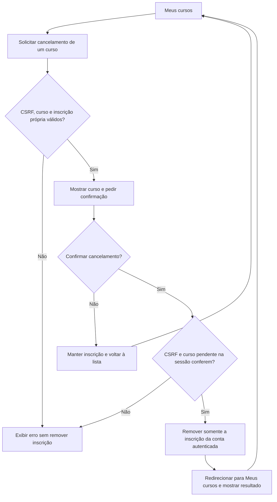

### Fluxo administrativo

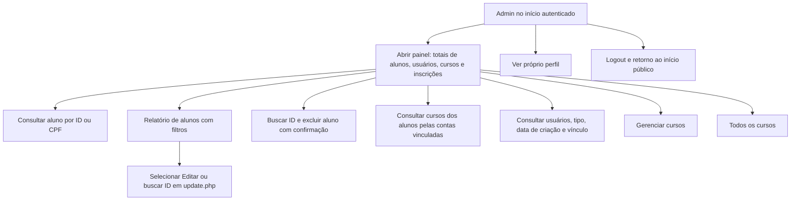

Os atalhos do menu administrativo também abrem essas áreas. Consultar usuários é uma listagem; essa tela não oferece edição ou exclusão de contas.

### Consulta e edição de aluno

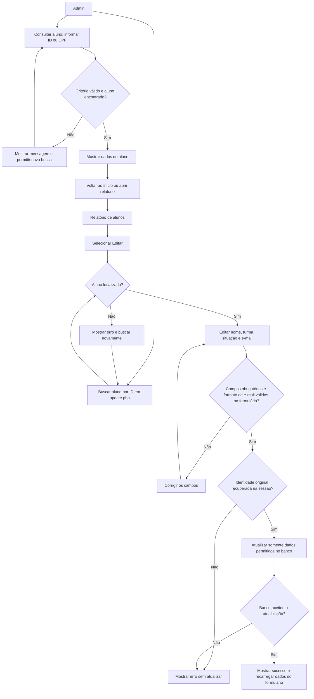

ID, CPF, nascimento e vínculo já preenchido são protegidos. A validação dos campos da edição ocorre no formulário do navegador; o servidor recupera a identidade original e grava apenas os campos permitidos. A consulta individual não tem botões diretos de editar/excluir: a edição usa o relatório ou `update.php`, e a exclusão usa a busca de `delete.php`.

O fluxo de exclusão de aluno foi preservado em **Exclusão com confirmação**: exige confirmação inicial e, se a conta vinculada tiver inscrições, uma segunda confirmação com a lista de cursos. Cancelar mantém o cadastro; excluir remove somente o aluno e seu vínculo, preservando conta e inscrições.

### Gestão administrativa de cursos

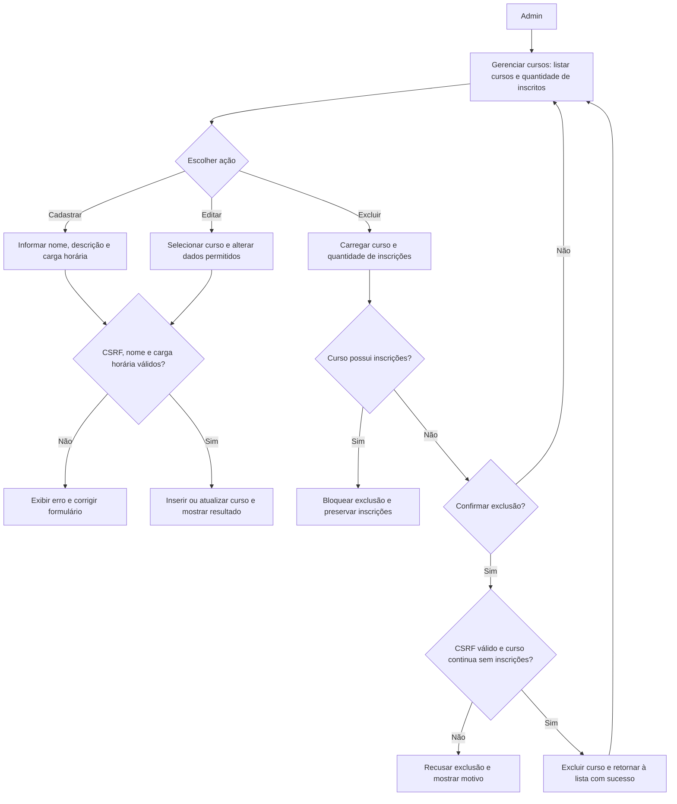

O banco também impede excluir cursos com inscrições, inclusive se surgir uma inscrição durante a confirmação. Cadastro e edição apresentam erro quando a gravação não pode ser concluída.

### Recuperação de senha

O diagrama técnico em **Recuperação de senha demonstrativa local** integra o fluxo geral. O acesso começa no link Esqueci minha senha do login. Apenas contas `tipo = usuario` podem redefinir a senha, em conexão local e na mesma sessão do navegador. Uma conta não elegível recebe a mesma mensagem e link genéricos, mas não uma recuperação válida. O token dura dez minutos; a redefinição valida token, prazo, tipo da conta, CSRF e confirmação da nova senha, grava `password_hash()` e invalida o token após sucesso. A tela oferece Voltar para entrar; não redireciona automaticamente nem autentica a conta.

## Diagrama de casos de uso

Representação conceitual em `flowchart LR`: os atores ficam fora dos grupos de funções; as linhas sem seta ligam atores a casos de uso e as setas pontilhadas mostram decomposição ou navegação. Não representam herança de permissões nem relações UML formais.

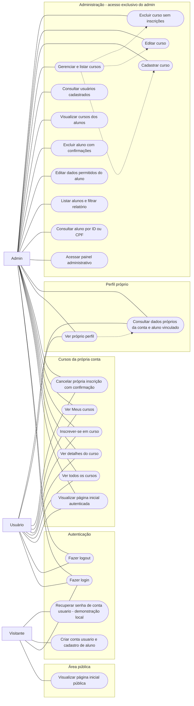

- **Visitante:** pessoa sem autenticação, com acesso à página pública, login, cadastro e solicitação de recuperação local para uma conta comum.
- **Usuário:** conta comum autenticada, com acesso aos cursos, inscrições, cancelamento e próprio perfil. Não gerencia alunos, contas, vínculos ou cursos administrativos.
- **Admin:** conta administrativa responsável por consultas e gestão de alunos e cursos, com acesso ao próprio perfil. Também pode usar as rotas de cursos da própria conta; não participa da recuperação de senha.

Ver perfil e consultar dados próprios são aspectos da mesma página, não telas distintas. A criação de aluno ocorre no cadastro público com vínculo automático na mesma transação. A exclusão de aluno preserva a conta e suas inscrições; a exclusão de curso é bloqueada se houver inscrições.
