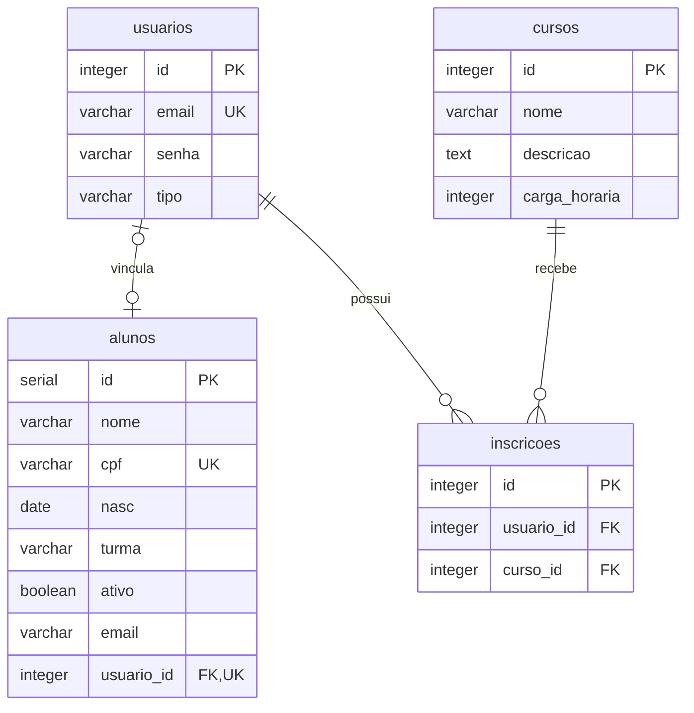
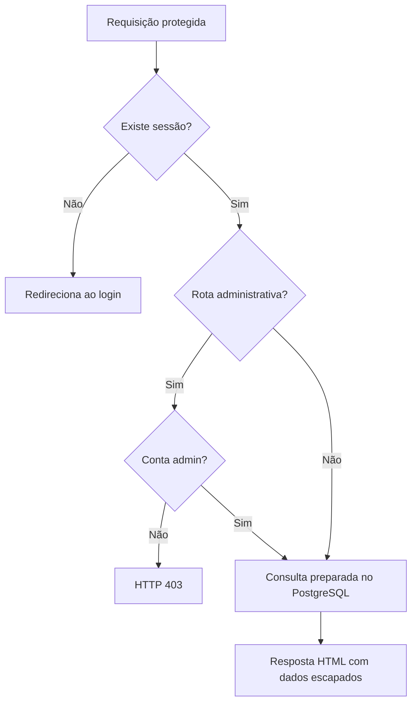
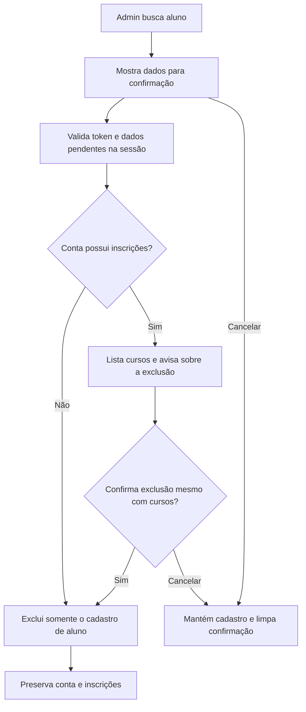
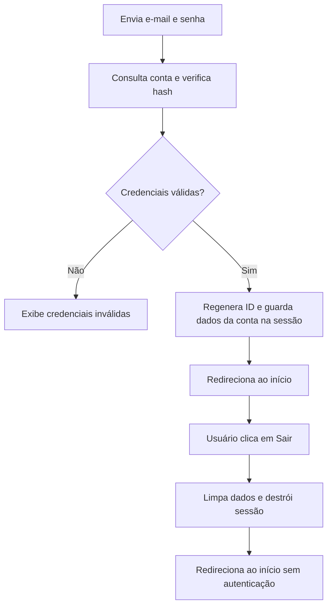
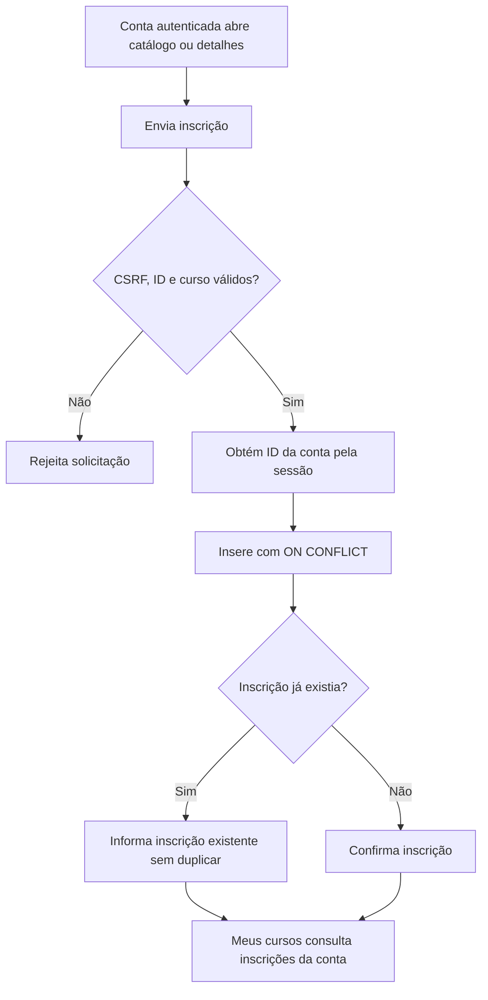
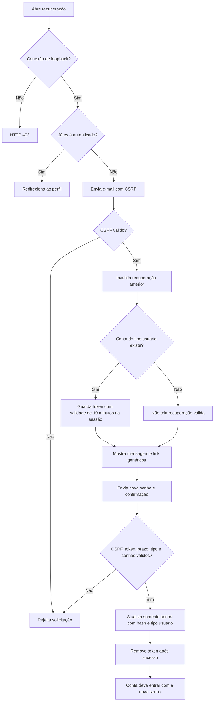

# Diagramas do CRUD

Os arquivos do CRUD utilizam a tabela `alunos`.

O campo `id` é a chave primária. `alunos.usuario_id` é uma FK opcional e única para `usuarios(id)`.

## Tabela alunos

## create.php

Cadastra um novo aluno.

O campo `id` é gerado automaticamente pelo banco de dados.

## select.php

Lista os alunos cadastrados em ordem do  menor pro maior com base no  `id`.

## select_w_w.php

Busca e mostra um aluno específico pelo ID ou CPF informado.

## update.php

Busca um aluno pelo `id` e permite alterar:

- nome
- turma
- situação do aluno
- e-mail

ID, CPF, nascimento e vínculo já preenchido são imutáveis. A inscrição pertence à conta e o par `(usuario_id, curso_id)` é único; `alunos.turma` não gera inscrições automaticamente.

## delete.php

Busca um aluno pelo `id`.

Antes da exclusão, mostra o nome e a turma do aluno e pede confirmação para excluir.

## Fluxo de uma requisição

## Vínculo e perfil

O admin informa o ID do aluno e o e-mail de uma conta real, confere os dados e confirma com token CSRF. O servidor usa os dados pendentes da sessão para criar o vínculo.

O perfil consulta o aluno por `$_SESSION['id']`. Sem vínculo, informa que a conta ainda não está vinculada a um cadastro de aluno. Cursos funcionam também para contas sem aluno.

## Exclusão com confirmação

A segunda tela fica em `delete.php`. Excluir o aluno remove seu vínculo e o perfil passa a informar ausência de cadastro.

## Login e logout

O login usa `password_verify()`. Após o logout, páginas protegidas exigem nova autenticação.

## Inscrição em curso

A inscrição não depende de cadastro de aluno. O par `(usuario_id, curso_id)` é único no banco.

## Recuperação de senha demonstrativa local

Não há envio de e-mail nem verificação de identidade. Use somente contas de teste no próprio computador. O fluxo não cria tabelas nem realiza login automático.
